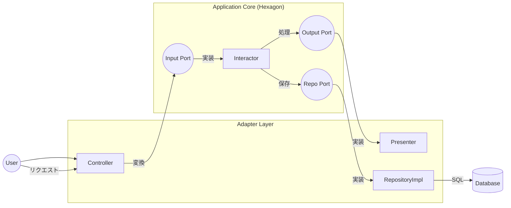

### ==ポートとアダプター==

**別名**: ヘキサゴナルアーキテクチャ (Hexagonal Architecture)
**提唱者**: Alistair Cockburn

クリーンアーキテクチャの根幹を成す、「アプリケーション」と「外界」を切り離すための設計パターン。

![[port.png]]

---

#### ==1. 直感的なイメージ (USBの例)==

パソコンと周辺機器の関係に例えると理解しやすい。

* **アプリケーション (ユースケース)** = **ノートパソコン本体**
* **ポート (Port)** = **USB差し込み口 (インターフェース)**
    * パソコン側にある。「ここに挿してね」という規格。
    * パソコンは、挿さるものがマウスかキーボードかUSBメモリかを知らない。
* **アダプター (Adapter)** = **USBコネクタを持つ機器 (実装)**
    * 外界（現実世界）の信号を、パソコンが理解できるUSB信号に変換する装置。

---

#### ==2. クリーンアーキテクチャでのマッピング==

クリーンアーキテクチャの用語を「ポート」と「アダプター」に当てはめると以下のようになる。

##### ① ポート (Ports)
**場所**: **内側 (ユースケース層)**
**実体**: **インターフェース (Interface)**

アプリケーションが外界と対話するための「出入り口」の定義。

* **入力ポート (Input Port)**
    * アプリケーションが「使われる」ための入り口。
    * Clean Archでの名前: **Input Boundary** (または UseCase Interface)
* **出力ポート (Output Port)**
    * アプリケーションが外界を「使う」ための出口。
    * Clean Archでの名前: **Output Boundary**, **Repository Interface**

##### ② アダプター (Adapters)
**場所**: **外側 (インターフェースアダプター層)**
**実体**: **クラス (Class)**

ポート（インターフェース）に適合するようにデータを変換する変換器。

* **主導側アダプター (Driving / Primary Adapter)**
    * アプリケーションを「起動する」側。
    * Clean Archでの名前: **Controller**
    * *役割*: HTTPリクエストなどをInput Port（メソッド引数）に変換してInteractorを呼ぶ。
* **受動側アダプター (Driven / Secondary Adapter)**
    * アプリケーションから「呼ばれる」側。
    * Clean Archでの名前: **Presenter**, **Gateway (Repository Impl)**
    * *役割*: Interactorからの指示（Output Port）を受けて、SQLを実行したりHTMLを作ったりする。

---

#### ==3. なぜポートとアダプターが必要か？==

##### テスト容易性 (Testability)
* **ポート（規格）**さえ合っていれば、本物のアダプターでなくても動く。
* 本物のDBアダプターの代わりに、「メモリ上に保存するだけのテスト用アダプター（Mock）」をポートに挿すことで、爆速でテストが可能になる。

##### 技術の独立性 (Swap-ability)
* Web用のアダプター（Controller）を、CLI用のアダプター（Command）に付け替えるだけで、ロジックを一切変えずにコンソールアプリ化できる。
* MySQL用のアダプターを、Firestore用のアダプターに付け替えるだけでDBを移行できる。

---

#### ==4. 処理の流れの図解==

1. **Controller (Adapter)** が入力を受け取り、**Input Port** を通じて **Interactor** を呼ぶ。
2. **Interactor** は処理を行い、**Repo Port** を通じてデータを保存し、**Output Port** を通じて結果を返す。
3. **RepositoryImpl (Adapter)** と **Presenter (Adapter)** がそれぞれのポートの実装として機能する。