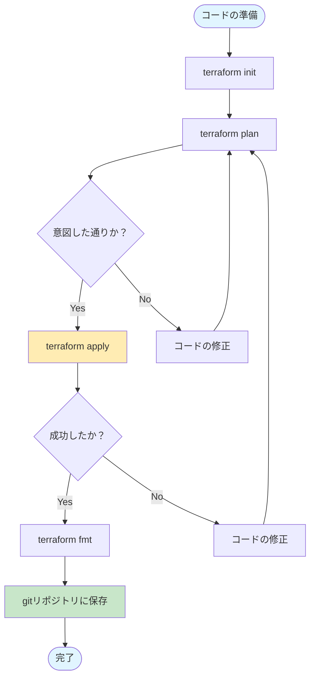

### 概要

「習うより慣れろ」で覚えよう！

```bash

// terraform インストール
brew tap hashicorp/tap
brew install hashicorp/tap/terraform

//タブ補完の設定
terraform -install-autocomplete
touch ~/.zshrc
```

### 詳細

#### ==TFファイルの作成==
拡張子は「.tf」

Dockerのプロパイダーを使いローカルにNginxのコンテナを起動し、ポート8000番でアクセスを待つようにするというものです。
```tf
terraform {
  required_providers {
		docker = {
			source = "kreuzwerker/docker"
			version = ">=3.0.0"
		}
  }
}

provider "docker" {
	host = "unix:///var/run/docker.sock"
}

resource "docker_image" "nginx" {
	name = "nginx:latest"
	keep_locally = true
}

resource "docker_container" "nginx" {
	image = docker_image.nginx.image_id
	name = "tutorial"
	ports {
		internal = 80
		external = 8000
	}
}
```

#### ==初期化==
`terraform init`
以下処理を行う
- プロパイダーのインストール
- バックエンドの初期化設定
- モジュールのインストール

初期化しないとコマンド実行時にエラーが出る。
何度実行しても問題ない。
「.terraform」ディレクトリが作成される

#### ==構築==
`terraform plan`
何をどう追加・変更されるかの構築プランが表示されます
文法ミスや想定外のリソース操作も確認可能

#### ==実行==
`terraform apply`コマンドを実行してコンテナを立ち上げてみましょう。
実行後、確認を求められるので「yes」と入力

#### ==コードを読み解く==

##### Terraformブロック
```terraform
terraform {
	required_providers {
		docker = {
			source = "kreuzwerker/docker"
			version = ">=3.0.0"
		}
	}
}
```
- プロパイダーへの要求事項を設定
- HCP Terraformの設定（5章で解説）
- ステートファイルのHCP Terraformへの移行（5章で解説）

Terraform Registryというサイトで公開されている「kreuzwerker/docker」というプロパイダーを「docker」という名前で利用します。
バージョンは「3」以上

##### Provider ブロック

```terraform
provider "docker" {
	host = "unix:///var/run/docker.sock"
}
```
プロパイダーの設定を行なっている
hostでローカル環境のDockerを使う設定を行う
どのような設定をできるかはプロパイダーによって異なるのでサイトで確認

##### Resourceブロック
```terraform

resource "<リソースタイプ名>" "<ローカルリソース名>" {
	<引数名> = <値>
	<引数名> = <値>
}
```
最も基本的なブロックで1行ないし、複数のインフラオブジェクトを記述するためのものです。

```terraform
resource "docker_image" "nginx" {
	name = "nginx:latest"
	keep_locally = true
}
```
`
`docker_image` リソースタイプは、先ほど読み込んだプロパイダーによって提供されたものです。
このリソースにより `nginx:latest` タグが付いたコンテナイメージがダウンロードされます。
nginxというローカルリソース名がついており、Terraform内部ではその名称で参照できます。
ローカルリソース名は一連のTerraformの構成ファイルの中で一意である必要がある。

```terraform
resource "docker_container" "nginx" {
	image = docker_image.nginx.image_id
	name = "tutorial"
	ports {
		internal = 80
		external = 8000
	}
}
```
Dockerコンテナの定義で、この記述でDocker上にコンテナを立ち上げ可能

`resource "docker_image" "nginx"` で定義した値を指定している `nginx:latest` も可能
またname引数でコンテナの名前を指定している他、portsブロックを使って、コンテナで利用するポートを指定しています。
`docker_container` リソースで利用可能な引数については、ドキュメントを参照

#### ==実行後生成されるファイル==

##### ステートファイル（terraform.tfstate）
Terraformが構築・管理している対象のインフラに関する状態を保存するためのファイルです。

###### 実行環境との紐付け
ステートファイルのDockerのIDとDockerコンテナのIDが紐づいている

###### メタデータの格納
リソースを管理するには紐付けだけではなく、その他の付加情報も必要
依存関係などを保存しておくことで、把握しなくても最適に自動で行えるようになる

###### パフォーマンスの向上
キャッシュとして活用して、変更があった部分のみインフラへのリクエストを行う

##### ステートファイルの管理について
<mark style="background: #D2B3FFA6;">ファイルを手動で削除したり変更したりしない</mark>


#### ==変数の利用==

##### 変数の宣言
```terraform
variable "container_name" {
	default = "tutorial"
	type = string
	description = "Tha name of the container"
}
```

`variable` ブロックのパラメータはオプショナルなので省略可能
- `default` ： 変数に値が設定されていない場合に利用する値
- `type` ：変数の型
- `description` ：値のバリデーション
- `sensitive` ：センシティブ（パスワード）な値であることを示すフラグ
- `bullable` ：nullを許容するかどうかのフラグ

##### 変数の利用

`name = var.container_name`
`var.` 変数名という形で、変数を呼び出すことができる

##### 変数の設定
設定方法は下記で、優先順位は下に行くほど高い
- 環境変数
- terraform.tfvars
- terraform.tfvars.json
- *.auto.vars もしくは *.auto.vars.json
- -varおよび-var-fileオプション

###### 環境変数として渡す
```bash
export TF_VAR_container_name="my-container-via-env"
terraform plan
```

- `export`: 環境変数を設定するシェルコマンド
- `TF_VAR_`: Terraformが認識する特別なプレフィックス
- `container_name`: Terraform側で定義した変数名
- `"my-container-via-env"`: 設定する値

##### terraform.tfvarsを利用する
`terraform.tfvars` というファイルを作成し、変数を設定します。このファイルは、main.tfと同じディレクトリに配置します
`container_name = "my-contaienr-via-tfvars"`

###### -varオプションを利用する
「terraform -plan」「terraform apply」の実行時に、「-var」 オプションを利用して変数を設定可能
`terraform plan -var container_name="my-contaienr-via-tfvars"``

#### ==Terraform化はどのくらい徹底すべきか==
- 繰り返し行う操作は、terraformを徹底する
- 一度作成したものは、terraform管理を徹底する
- 手作業したものは、忘れないうちにterraform化する


#### ==構築した環境を変更する==

##### HCLの整形
`terraform fmt`

##### TFファイルの更新
更新したら `terraform apply`

`-/+` は既存のものを破棄して作り直すの意味、一般的には問題にはならないが予期しないリソースが削除されないか気を付ける

- `+` ：は、この項目が環境に追加されることを示す
- `-` ：は、この項目が環境から削除されることを示す
- `~` ：は、この項目が変更されることを示す

##### terraform destroy
`terraform destroy` で削除コマンドを実行

#### ==Terraformのコマンド==

##### よく利用するコマンド

| コマンド     | 役割                            |
| -------- | ----------------------------- |
| init     | 作業ディレクトリの初期化                  |
| plan     | 現在のコンフィグで実行プラン表示              |
| apply    | 構築・変更の実行                      |
| destroy  | 環境の削除                         |
| validate | コンフィグが正しいかを確認                 |
| console  | Terraformの文法を対話的に実行して試す       |
| fmt      | コンフィグを標準スタイルに整形               |
| import   | 既存のインフラリソースをTerraformリソースに紐付け |
| login    | HCP Terraformにログイン            |
| refresh  | リモートの状態に合うようにステートファイルをアップデート  |
| state    | ステートファイルの操作（さらにサブコマンドあり）      |
| test     | Terraformモジュールのテスト実行          |


##### コマンドの流れ


